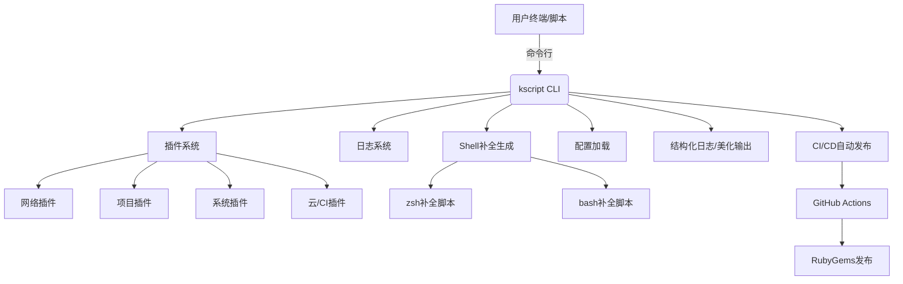

# kscript

```
______                     _____        _____
___  /________________________(_)_________  /_
__  //_/_  ___/  ___/_  ___/_  /___  __ \\  __/
_  ,<  _(__  )/ /__ _  /   _  / __  /_/ / /_
/_/|_| /____/ \\___/ /_/    /_/  _  .___/\\__/
                                /_/
```

[](https://rubygems.org/gems/kscript)
[](https://github.com/kevin197011/kscript/actions/workflows/gem-push.yml)

> Ruby CLI 工具集，专为系统运维、开发自动化、网络与项目管理场景设计。支持插件化、美化输出、自动补全、结构化日志、CI/CD 自动发布等现代特性。

---

## 🗺️ 架构图



## ✨ 特性亮点
- 统一 CLI 框架，所有命令一键调用，美化输出
- 插件化架构，业务命令即插件，易扩展、易维护
- 美化输出：ASCII banner、彩色分组、分隔线
- 人性化/结构化日志双模式：`--log`/`--log-level` 切换，支持 JSON/终端友好输出
- 自动补全：zsh/bash 补全脚本自动部署
- 参数健壮：所有插件兼容多余参数，支持全局参数过滤
- CI/CD 自动发布：GitHub Actions 自动构建并推送 RubyGem
- 多平台支持：macOS、Linux，部分工具支持 Windows
- 自动生成配置：首次安装自动生成 `~/.kscript/.env` 配置示例

---

## 🚀 安装

```bash
gem install kscript
```

或源码安装：

```bash
git clone https://github.com/kevin197011/kscript.git
cd kscript
gem build kscript.gemspec
gem install ./kscript-*.gem
```

---

## 🛠️ 快速上手

### 查看所有命令
```bash
kscript list
```

### 查看主命令帮助
```bash
kscript help
```

### 查看版本
```bash
kscript version
```

### 执行插件命令
```bash
kscript <command> [args...]
# 例如
kscript apnic_ip CN
kscript port_scan 192.168.1.1
kscript shell_helper 'ls -l'
kscript project_scan ~/projects
kscript aws_s3 --file local.txt --bucket my-bucket --key test.txt --region ap-northeast-1 --access_key xxx --secret_key yyy
```

### 结构化日志模式
```bash
kscript apnic_ip CN --log
kscript port_scan 192.168.1.1 --log-level=debug
```

---

## 🧩 插件与命令一览

> 运行 `kscript list` 可分组美化展示所有插件命令

| 分组      | 命令                   | 用法示例                                                         | 参数说明                                               | 描述                                                         |
|-----------|------------------------|------------------------------------------------------------------|--------------------------------------------------------|--------------------------------------------------------------|
| network   | `apnic_ip`             | `kscript apnic_ip CN`                                            | `[country_code]`                                       | Get APNIC IPv4 ranges for a country.                         |
| network   | `port_scan`            | `kscript port_scan 192.168.1.1`                                  | `<target_host> [ports] [thread_count]`                 | Scan open ports on a target host.                            |
| network   | `ip_lookup`            | `kscript ip_lookup 8.8.8.8`                                      | `<ip_address>`                                         | Query IP geolocation and ISP info.                           |
| network   | `wg_acl`               | `kscript wg_acl add --ip=10.0.0.2`                               | `[subcommand] [options]`                               | Manage WireGuard firewall ACL rules.                         |
| network   | `wg_pass`              | `kscript wg_pass 32`                                             | `[length]`                                             | Generate a random password for WireGuard.                    |
| project   | `project_scan`         | `kscript project_scan ~/projects/src`                            | `[src_path]`                                           | Scan and list all git projects in a directory.               |
| project   | `vcs_cleaner`          | `kscript vcs_cleaner ~/projects/src`                             | `[src_path]`                                           | Clean old source code versions, keep N latest.               |
| project   | `file_rename`          | `kscript file_rename foo bar ./src`                              | `<pattern> <replacement> [path]`                       | Batch rename files by pattern.                               |
| system    | `shell_helper`         | `kscript shell_helper 'ls'`                                      | `[subcommand] [args...]`                               | Query shell command usage and cheatsheets.                   |
| system    | `lvm_manage`           | `kscript lvm_manage /dev/sda2 /mnt/data`                         | `<device> <mount_point>`                               | Mount and manage Linux LVM volumes.                          |
| macos     | `mac_status`           | `kscript mac_status`                                             |                                                        | Show macOS system resource monitor report.                   |
| macos     | `mac_optimize`         | `kscript mac_optimize`                                           |                                                        | Optimize macOS system performance.                           |
| media     | `ffmpeg_install`       | `kscript ffmpeg_install 6.0`                                     | `[version]`                                            | Install and verify FFmpeg on Linux.                          |
| elastic   | `elastic_cert_finger`  | `kscript elastic_cert_finger ./ca.crt`                           | `<cert_file>`                                          | Generate Elasticsearch certificate SHA256 fingerprint.       |
| elastic   | `kibana_manage`        | `kscript kibana_manage export --host=localhost --index=log-*`    | `[subcommand] [options]`                               | Kibana automation: space, index, user, role management.      |
| ci        | `jenkins_manage`       | `kscript jenkins_manage list --host=jenkins.local`               | `[subcommand] [options]`                               | Jenkins job export/import automation.                        |
| cloud     | `aws_s3`               | `kscript aws_s3 --file local.txt --bucket my-bucket ...`         | `--file --bucket --key --region --access_key --secret_key` | Upload a file to AWS S3 for testing.                         |
| finance   | `usd_rate`             | `kscript usd_rate CNY`                                           | `[currency_code]`                                      | Get latest USD exchange rates.                               |

---

## ⚡ Shell 自动补全 & 配置示例

- 首次安装/升级自动为 zsh/bash 部署补全脚本，并生成 `~/.kscript/.env` 配置示例
- 补全脚本路径：
  - zsh: `~/.zsh/completions/_kscript`
  - bash: `~/.bash_completion.d/kscript`
- 配置文件路径：
  - `~/.kscript/.env`（自动生成，支持 ENV 变量注释说明）
- 手动生成补全：
  ```bash
  kscript completion zsh > ~/.zsh/completions/_kscript
  kscript completion bash > ~/.bash_completion.d/kscript
  ```

---

## ⚙️ 全局配置（.env 格式）

所有全局参数均通过 `~/.kscript/.env` 文件（自动生成，标准 .env 格式）或环境变量注入。例如：

```env
# AWS S3 upload config
AWS_BUCKET=my-bucket
AWS_REGION=ap-northeast-1
AWS_ACCESS_KEY_ID=xxx
AWS_SECRET_ACCESS_KEY=yyy

# Logging config
KSCRIPT_LOG_LEVEL=info
LOG=1
```
---

## 🧑‍💻 插件开发规范
- 插件文件统一放在 `lib/kscript/plugins/kk_xxx_utils.rb`
- 类名如 `KkApnicIpUtils`，自动注册为 `apnic_ip` 命令
- 支持 `self.description`、`self.usage`、`self.arguments`、`self.group`、`self.author`
- 输出统一用 `logger.kinfo`/`logger.kerror`，支持结构化日志
- 兼容多余参数，避免 ArgumentError
- 依赖统一在主入口 require，插件只需 require 'kscript'

---

## 🚚 CI/CD 自动发布

- `.github/workflows/gem-push.yml`：main 分支和 PR 自动构建、tag push 自动发布到 RubyGems
- 需在 GitHub secrets 配置 `RUBYGEMS_API_KEY`
- [CI 状态与历史](https://github.com/kevin197011/kscript/actions/workflows/gem-push.yml)

---

## 📦 依赖与兼容性

- Ruby >= 3.0
- 依赖：bcrypt, http, nokogiri, thor, aws-sdk-s3, httpx 等
- 支持 macOS、Linux，部分工具支持 Windows

---

## 📄 许可证

MIT License. 详见 [LICENSE](LICENSE)。

---

## 🤝 贡献

1. Fork & PR
2. 遵循输出与插件开发规范
3. 保持文档与代码同步

---

如需更多示例、插件开发指导或遇到问题，欢迎提 issue 或 PR！


