# kscript

```
______                     _____        _____
___  /________________________(_)_________  /_
__  //_/_  ___/  ___/_  ___/_  /___  __ \\  __/
_  ,<  _(__  )/ /__ _  /   _  / __  /_/ / /_
/_/|_| /____/ \\___/ /_/    /_/  _  .___/\\__/
                                /_/
```

[](https://rubygems.org/gems/kscript)
[](https://github.com/kevin197011/kscript/actions/workflows/gem-push.yml)

> Ruby CLI 工具集，专为系统运维、开发自动化、网络与项目管理场景设计。支持插件化、美化输出、自动补全、结构化日志、CI/CD 自动发布等现代特性。

---

## 🗺️ 架构图

```mermaid
graph TD
  A[用户终端/脚本] -->|命令行| B(kscript CLI)
  B --> C[插件注册与分发]
  B --> D[日志系统]
  B --> E[配置加载]
  B --> F[Shell补全生成]
  B --> G[结构化日志/美化输出]
  B --> H[CI/CD自动发布]
  F --> I1[zsh补全脚本]
  F --> I2[bash补全脚本]
  H --> J[GitHub Actions]
  J --> K[RubyGems发布]
```



## ✨ 特性亮点
- 统一 CLI 框架，所有命令一键调用，美化输出
- 插件化架构，业务命令即插件，易扩展、易维护
- 美化输出：ASCII banner、彩色分组、分隔线
- 人性化/结构化日志双模式：`--log`/`--log-level` 切换，支持 JSON/终端友好输出
- 自动补全：zsh/bash 补全脚本自动部署
- 参数健壮：所有插件兼容多余参数，支持全局参数过滤
- CI/CD 自动发布：GitHub Actions 自动构建并推送 RubyGem
- 多平台支持：macOS、Linux，部分工具支持 Windows
- 自动生成配置：首次安装自动生成 `~/.kscript/.env` 配置示例

---

## 🚀 安装

```bash
gem install kscript
```

或源码安装：

```bash
git clone https://github.com/kevin197011/kscript.git
cd kscript
gem build kscript.gemspec
gem install ./kscript-*.gem
```

---

## 🛠️ 快速上手

### 查看所有命令
```bash
kscript list
```

### 查看主命令帮助
```bash
kscript help
```

### 查看版本
```bash
kscript version
```

### 执行插件命令
```bash
kscript <command> [args...]
# 例如
kscript apnic_ip CN
kscript port_scan 192.168.1.1
kscript shell_helper 'ls -l'
kscript project_scan ~/projects
kscript aws_s3 --file local.txt --bucket my-bucket --key test.txt --region ap-northeast-1 --access_key xxx --secret_key yyy
```

### 结构化日志模式
```bash
kscript apnic_ip CN --log
kscript port_scan 192.168.1.1 --log-level=debug
```

---

## 🧩 插件与命令一览

> 运行 `kscript list` 可分组美化展示所有插件命令

| 分组      | 命令                   | 用法示例                                                         | 参数说明                                               | 描述                                                         |
|-----------|------------------------|------------------------------------------------------------------|--------------------------------------------------------|--------------------------------------------------------------|
| network   | `apnic_ip`             | `kscript apnic_ip CN`                                            | `[country_code]`                                       | Get APNIC IPv4 ranges for a country.                         |
| network   | `port_scan`            | `kscript port_scan 192.168.1.1`                                  | `<target_host> [ports] [thread_count]`                 | Scan open ports on a target host.                            |
| network   | `ip_lookup`            | `kscript ip_lookup 8.8.8.8`                                      | `<ip_address>`                                         | Query IP geolocation and ISP info.                           |
| network   | `wg_acl`               | `kscript wg_acl add --ip=10.0.0.2`                               | `[subcommand] [options]`                               | Manage WireGuard firewall ACL rules.                         |
| network   | `wg_pass`              | `kscript wg_pass 32`                                             | `[length]`                                             | Generate a random password for WireGuard.                    |
| project   | `project_scan`         | `kscript project_scan ~/projects/src`                            | `[src_path]`                                           | Scan and list all git projects in a directory.               |
| project   | `vcs_cleaner`          | `kscript vcs_cleaner ~/projects/src`                             | `[src_path]`                                           | Clean old source code versions, keep N latest.               |
| project   | `file_rename`          | `kscript file_rename foo bar ./src`                              | `<pattern> <replacement> [path]`                       | Batch rename files by pattern.                               |
| system    | `shell_helper`         | `kscript shell_helper 'ls'`                                      | `[subcommand] [args...]`                               | Query shell command usage and cheatsheets.                   |
| system    | `lvm_manage`           | `